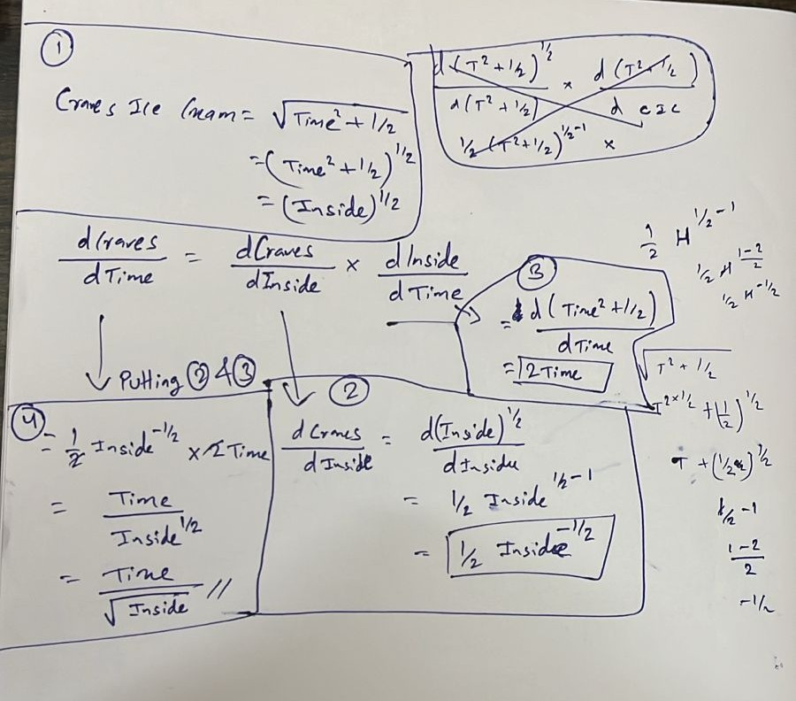

# Learning Artificial Intelligence  

Here I will be posting resources and projects related to my journey of learning artificial intelligence.  

Originally, I started my Computer Science journey with web development.  

---


## Projects

| # | Project Name | Description | Demo | GitHub |
|---|--------------|-------------|------|--------|
| 1 | **DChat - PDF Q&A Application** | Web application where users can upload PDFs and ask questions about their content using RAG (Retrieval-Augmented Generation) | [LinkedIn Demo](https://www.linkedin.com/posts/thinley-lama-842631252_ai-chatbot-rag-activity-7258469838874910721-ro5A?utm_source=share&utm_medium=member_desktop&rcm=ACoAAD5ipnIBKx11QjzcH6rujsE2BXJ-D3FhIOU) | [DChat Repository](https://github.com/blockx3/dchat) |
| 2 | **Handwritten Digit Recognition** | CNN-based model for recognizing handwritten digits using the MNIST dataset, integrated with Streamlit for user interaction | - | [Handwritten Digit Recognition](https://github.com/thinley4/Handwritten-digit-recognition) |
| 3 | **Gmail Agent - AI Email Assistant** | AI agent built with LangChain, Gemini model, and Streamlit to assist users with email composition | [LinkedIn Demo](https://www.linkedin.com/posts/thinley-lama-842631252_ai-aiagent-activity-7299138238336708610-Wxl6?utm_source=share&utm_medium=member_desktop&rcm=ACoAAD5ipnIBKx11QjzcH6rujsE2BXJ-D3FhIOU) | [Gmail Agent Repository](https://github.com/thinley4/Gmail-Agent) |
| 4 | **GPT from Scratch - Pretraining** | Implementation of GPT model from scratch with pretraining capabilities | - | [GPT Pretraining](https://github.com/thinley4/GPT-Pretrain) |
| 5 | **GPT-2 from Scratch - Finetuning** | GPT-2 implementation with classification finetuning for downstream tasks | - | [Classification Finetuning](https://github.com/thinley4/Classification-Finetune) |
| 6 | **Minimal Lunar Lander - DQN** | Reinforcement learning project using Deep Q-Networks with Gymnasium and Stable Baselines3 | - | [Minimal Lunar Lander DQN](https://github.com/thinley4/Minimal-Lunar-Lander-DQN) |
| 7 | **Q-Learning Implementation** | From-scratch implementation of Q-learning algorithm in Python for educational purposes | - | [Q-Learning Implementation](https://github.com/thinley4/Implementing-Q-learning) |
| 8 | **Weather Agent** | A weather forecasting agent built with LangChain and Google's Gemini AI model | - | [Weather Agent](https://github.com/thinley4/Weather-Agent) |
| 9 | **Multiplication tool** | Integrating tool with LLM | - | [Multiplication tool](https://github.com/thinley4/Multiplication-tool) |
| 10 | **Naive-Bayes-Spam-Detection** | Implements a Naive Bayes classifier to detect spam messages in SMS text | - | [Naive-Bayes-Spam-Detection](https://github.com/thinley4/Naive-Bayes-Spam-Detection) |

---

## Resources & References

### Research Papers
| # | Title | Link |
|---|-------|------|
| 1 | **Attention Is All You Need** | [arXiv:1706.03762](https://arxiv.org/pdf/1706.03762) |
| 2 | **ReAct: Synergizing Reasoning and Acting in Language Models** | [arXiv:2210.03629](https://arxiv.org/abs/2210.03629) |
| 3 | **Foundations of Large Language Models** | [arXiv:2501.09223](https://arxiv.org/pdf/2501.09223) |
| 4 | **DeepSeek-R1** | [arxiv.org/abs/2501.12948](https://arxiv.org/pdf/2501.12948) |

### Books & Articles
| # | Title | Author/Source | Link |
|---|-------|---------------|------|
| 1 | **How Large Language Models Work** | Microsoft Data Science Blog | [Medium Article](https://medium.com/data-science-at-microsoft/how-large-language-models-work-91c362f5b78f) |
| 2 | **Introduction to Machine Learning** | Ethem Alpaydin | [Google Books](https://www.google.co.in/books/edition/Introduction_to_Machine_Learning/1k0_-WroiqEC?hl=en&gbpv=0) |
| 3 | **LLMs from Scratch** | Sebastian Raschka | [GitHub Repository](https://github.com/rasbt/LLMs-from-scratch) |
| 4 | **Understanding Reasoning LLMs** | Sebastian Raschka | [Substack Article](https://magazine.sebastianraschka.com/p/understanding-reasoning-llms) |
| 5 | **Foundations of Machine Learning** | Tong Xiao and Jingbo Zhu | [Foundations of Machine Learning](https://niutrans.github.io/NLPBook/chapters/nlp-book-chapter1.pdf) |
| 6 | **Book on neural networks and large language models in NLP** | Tong Xiao and Jingbo Zhu | [Book on neural networks and large language models in NLP](https://github.com/NiuTrans/NLPBook?tab=readme-ov-file) |

### Courses & Tutorials
| # | Title | Platform/Author | Link |
|---|-------|-----------------|------|
| 1 | **Deep Learning with PyTorch - Full Course** | YouTube | [YouTube](https://www.youtube.com/watch?v=V_xro1bcAuA&t=48258s) |
| 2 | **Attention in Transformers: Concepts and Code in PyTorch** | DeepLearning.AI | [Course Link](https://learn.deeplearning.ai/courses/attention-in-transformers-concepts-and-code-in-pytorch/lesson/han2t/introduction) |
| 3 | **How Transformer LLMs Work** | DeepLearning.AI | [Course Link](https://learn.deeplearning.ai/courses/how-transformer-llms-work/lesson/nfshb/introduction) |
| 4 | **Build LLM Apps with LangChain.js** | DeepLearning.AI | [Course Link](https://learn.deeplearning.ai/courses/build-llm-apps-with-langchain-js/lesson/vchyb/introduction) |
| 5 | **Reinforcement Learning - Developing Intelligent Agents** | deeplizard | [Course Link](https://deeplizard.com/learn/video/nyjbcRQ-uQ8) |
| 6 | **Let's build GPT: from scratch** | Andrej Karpathy | [Link](https://www.youtube.com/watch?v=kCc8FmEb1nY&t=21s) |
| 7 | **Neural Networks: Zero to Hero** | Andrej Karpathy | [Link](https://www.youtube.com/watch?v=VMj-3S1tku0&list=PLAqhIrjkxbuWI23v9cThsA9GvCAUhRvKZ) |
| 8 | **building a ChatGPT-like model** | Standford | [Link](https://www.youtube.com/watch?v=9vM4p9NN0Ts&t=5244s) |
| 9 | **Machine Learning Specialization – Andrew Ng (Autumn 2018)** | Standford | [Link](https://www.youtube.com/watch?v=jGwO_UgTS7I&list=PLoROMvodv4rMiGQp3WXShtMGgzqpfVfbU) |
| 10 | **Build an LLM from Scratch** | Sebastian Raschka | [PlayList](https://www.youtube.com/watch?v=yAcWnfsZhzo&list=PLTKMiZHVd_2Licpov-ZK24j6oUnbhiPkm&index=8) |
| 11 | **Hands on Reinforcement Learning** | Vizuara | [Link](https://www.youtube.com/watch?v=wz141j9qIaU) |
| 12 | **Neural Networks / Deep Learning** | StatQuest with Josh Starmer | [Playlist Neural Networks](https://www.youtube.com/watch?v=zxagGtF9MeU&list=PLblh5JKOoLUIxGDQs4LFFD--41Vzf-ME1) |

### Other Resources
| # | Topic | Link |
|---|-------|------|
| 1 | **Mixture of Experts (MoE)** | [Hugging Face Blog](https://huggingface.co/blog/moe#what-is-a-mixture-of-experts-moe) |
| 2 | **Multi-agent** | [Multi-agent-LangGraph](https://langchain-ai.github.io/langgraph/agents/multi-agent/) |
| 3 | **ReAct agent from scratch with Gemini 2.5 and LangGraph** | [ReAct agent Gemini 2.5](https://ai.google.dev/gemini-api/docs/langgraph-example) |
| 4 | **Humanoid Gymnasium** | [Humanoid Environment](https://gymnasium.farama.org/environments/mujoco/humanoid/) |
| 6 | **Call tools LangGraph** | [Link](https://langchain-ai.github.io/langgraph/how-tos/tool-calling/) |
---

### 1. DChat Application  
I built an application called **DChat**, which is a web application where users can upload PDFs and ask questions related to them.  
Here, I encountered LLM models like **Gemini 2.0 Flash** and **Mistral AI**, which I used in my application. From there, I got curious about how these models were able to give such great responses. After this, I wanted to know how LLMs work internally.  

- **Demo link:** [LinkedIn Demo](https://www.linkedin.com/posts/thinley-lama-842631252_ai-chatbot-rag-activity-7258469838874910721-ro5A?utm_source=share&utm_medium=member_desktop&rcm=ACoAAD5ipnIBKx11QjzcH6rujsE2BXJ-D3FhIOU)  
- **GitHub link:** [DChat Repository](https://github.com/blockx3/dchat)  

While building this RAG-based chatbot, I spent a large amount of time reading **LangChain (Python and JavaScript) documentation** and implementing concepts.  

Here I was introduced to:  
- **Embedding data** – converting words into numerical form  
- **Vector databases** (Postgres + PGVector)  

---

### 2. Article: How LLMs Work  
I found a great article that explained **how LLMs work**. This blog gave me an idea of the internal workings of LLMs.  
- [Read here](https://medium.com/data-science-at-microsoft/how-large-language-models-work-91c362f5b78f)  

---

### 3. Andrej Karpathy – Neural Networks: Zero to Hero  
I enrolled in the **Zero to Hero playlist** by Andrej Karpathy.  

I started with:  
- **Let’s build GPT: from scratch, in code, spelled out**  
  - [YouTube Link](https://www.youtube.com/watch?v=kCc8FmEb1nY&t=21s)  

We built GPT following the paper *“Attention is All You Need”*.  

Here I learned about:  
- Tokenization, train/val split  
- Self-attention  
- Transformer, feedforward  
- Multi-headed self-attention  

It was a hands-on learning experience where I coded along in Colab using **PyTorch**. I was also introduced to the PyTorch documentation. Honestly, I didn’t understand everything, but I was able to get the intuition. I spent 3–4 days completing the 2-hour video.  

I also did hands-on work with:  
- **The spelled-out intro to neural networks and backpropagation: building micrograd**  
  - Learned *manual backpropagation*, derivation, and the importance of mathematics in neural networks.  

Other useful resources:  
- [Video 1](https://www.youtube.com/watch?v=PaCmpygFfXo&t=150s)  
- [Video 2](https://www.youtube.com/watch?v=TCH_1BHY58I&t=1243s)  

In my opinion, these videos are great resources but require some prior knowledge to fully follow along.  

---

### 4. Project: Handwritten Digit Recognition  
In this project, I used the **MNIST dataset** consisting of handwritten digit images and created a **Convolutional Neural Network (CNN)** model.  

- Trained the CNN model on the dataset, and the model was able to predict handwritten digits.  
- Integrated the model with **Streamlit**, where users can upload an image and get the predicted digit.  

- **GitHub link:** [Handwritten Digit Recognition](https://github.com/thinley4/Handwritten-digit-recognition)  

---

### 5. Stanford YouTube Videos  
Some great resources available online:  
- [Stanford CS229 | Machine Learning | Building Large Language Models (LLMs)](https://www.youtube.com/watch?v=9vM4p9NN0Ts&t=5244s)  
- [Introduction to Convolutional Neural Networks for Visual Recognition](https://www.youtube.com/watch?v=vT1JzLTH4G4&t=3s)  
- [Image Classification](https://www.youtube.com/watch?v=OoUX-nOEjG0)  
- [Loss Functions and Optimization](https://www.youtube.com/watch?v=h7iBpEHGVNc&t=853s)  

---

### 6. Machine Learning Specialization – Andrew Ng (Autumn 2018)  
- [Lecture Playlist](https://www.youtube.com/watch?v=jGwO_UgTS7I&list=PLoROMvodv4rMiGQp3WXShtMGgzqpfVfbU)  
- [GitHub Code](https://github.com/greyhatguy007/Machine-Learning-Specialization-Coursera)  

I have completed **4 lectures** so far and look forward to completing the rest soon.  

---

### 7. PyTorch  
I started learning **PyTorch** and spent about a week jumping between tutorials and the documentation.  

Resources I followed:  
- [Deep Learning with PyTorch – Full Course](https://www.youtube.com/watch?v=V_xro1bcAuA&t=48258s)  
- [Learn PyTorch](https://www.learnpytorch.io/)  
- [PyTorch Official Documentation](https://docs.pytorch.org/docs/stable/index.html)  

---

### 8. Project: AI Agent (Gmail Agent)  
I built a **Gmail Agent** project using **LangChain**, **Gemini model**, and **Streamlit**.  
Users can simply provide information, and the agent assists accordingly.  

- **Demo link:** [LinkedIn Demo](https://www.linkedin.com/posts/thinley-lama-842631252_ai-aiagent-activity-7299138238336708610-Wxl6?utm_source=share&utm_medium=member_desktop&rcm=ACoAAD5ipnIBKx11QjzcH6rujsE2BXJ-D3FhIOU)  
- **GitHub link:** [Gmail Agent Repository](https://github.com/thinley4/Gmail-Agent)  

---

### 9. Sebastian Raschka – LLMs from Scratch  
Among all resources, this one is my favorite. I got the chance to **build LLMs from scratch** with step-by-step explanations and code.  

What I learned:  
- Tokenization, token IDs, special context tokens, byte pair encoding  
- Data sampling with a sliding window  
- Token embeddings, positional encoding  
- Self-attention mechanism, causal attention mask, multi-head attention  
- Transformer blocks with layer normalization, GELU activations, residual connections  
- Implementing GPT model and text generation  
- Loss functions (cross-entropy, perplexity), training/validation losses  
- Saving/loading pretrained weights  
- Finetuning LLMs for tasks like spam classification  
- Supervised instruction finetuning on datasets  

Resources:  
- [GitHub Repository](https://github.com/rasbt/LLMs-from-scratch)  
- [YouTube Playlist](https://www.youtube.com/watch?v=4yNswvhPWCQ&list=PLTKMiZHVd_2Licpov-ZK24j6oUnbhiPkm)  

This was hands-on and very clear, making it easier to understand concepts.  

---

### 10. Courses  
Some courses that really helped me understand concepts better:  
- [Attention in Transformers: Concepts and Code in PyTorch](https://learn.deeplearning.ai/courses/attention-in-transformers-concepts-and-code-in-pytorch/lesson/han2t/introduction)  
- [How Transformer LLMs Work](https://learn.deeplearning.ai/courses/how-transformer-llms-work/lesson/nfshb/introduction)  
- [Build LLM Apps with LangChain.js](https://learn.deeplearning.ai/courses/build-llm-apps-with-langchain-js/lesson/vchyb/introduction)  

---

### 11. Book  
I am reading the book **“Introduction to Machine Learning” by Ethem Alpaydin**.  
Whenever I am not clear about a concept, I refer to this book to strengthen my understanding.  

- [Book Link](https://www.google.co.in/books/edition/Introduction_to_Machine_Learning/1k0_-WroiqEC?hl=en&gbpv=0)  

---

### 12. Hands-On Reinforcement Learning  
I watched this video to get introduced to **Reinforcement Learning (RL)**:  
- [Introduction to RL](https://www.youtube.com/watch?v=wz141j9qIaU)  

---

### 13. Project: Minimal Lunar Lander – DQN  
I built this **Reinforcement Learning project** using **Gymnasium** and **Stable Baselines3**.  

- **GitHub link:** [Minimal Lunar Lander DQN](https://github.com/thinley4/Minimal-Lunar-Lander-DQN)  

---

From today, I will document my daily learning progress.

**Day 1: Q-Learning**

**Exploration vs. Exploitation**  
- Balancing exploration (trying new actions) and exploitation (choosing known best actions) is crucial in reinforcement learning.  
- Q-Learning is a technique that helps agents learn optimal actions through experience.


**Epsilon-Greedy Strategy**  
- The agent starts with a high exploration rate (E = 1), taking random actions to discover new possibilities.  
- As learning progresses, E decreases, and the agent exploits its knowledge more by choosing actions with higher Q-values.


**How Actions Are Chosen**  
- At the initial state, the agent selects actions randomly due to high exploration.  
- Over time, the agent uses the epsilon-greedy strategy to balance exploration and exploitation.  
- When exploiting, the agent picks the action with the highest Q-value for the current state from the Q-table.


**Q-Learning Process**  
- After each action, the agent observes the next state and reward, then updates the Q-value in the Q-table for the previous state-action pair.

**Resource:**  
- [Q-Learning Video](https://deeplizard.com/learn/video/mo96Nqlo1L8)

---

**Day 2: Markov Decision Processes (MDPs)**

Markov decision processes give us a way to formalize sequential decision making

A Markov Decision Process models the sequential decision-making of an agent interacting with an environment. At each step, the agent selects an action from the current state, transitions to a new state, and receives a reward. This sequence of states, actions, and rewards forms a trajectory.

The agent’s objective is to maximize the cumulative reward over time, not just the immediate reward from each action. This encourages the agent to consider long-term benefits when making decisions.

**MDP Mathematical Representation**


**Resource:**  
- [MDP](https://deeplizard.com/learn/video/my207WNoeyA)

---

**Day 3: Implementing Q-Learning in Python**

**Hands-on Q-Learning Implementation**
- Implemented the Q-learning algorithm from scratch in Python to gain deeper intuitive understanding
- The practical coding experience clarified theoretical concepts and made the algorithm more concrete
- Translated the mathematical Q-table update formula into working code:


**Key Learning Outcomes:**
- Better understanding of how Q-values are calculated and updated iteratively
- Practical experience with epsilon-greedy action selection
- Implementation of the reward feedback mechanism in reinforcement learning

**Project:** [Q-Learning Implementation](https://github.com/thinley4/Implementing-Q-learning)

---

**Day 4: Value Functions and Optimality in Reinforcement Learning**

**Value Functions Overview**
Value functions are functions of states, or of state-action pairs, that estimate how good it is for an agent to be in a given state, or how good it is for the agent to perform a given action in a given state.


**State-Value Function**
It tells us how good any given state is for an agent following policy.

**Action-Value Function (Q-Function)**
It tells us how good it is for the agent to take any given action from a given state while following policy.

**Optimality in Reinforcement Learning**
It is the goal of reinforcement learning algorithms to find a policy that will yield a lot of rewards for the agent if the agent indeed follows that policy.


**Value Iteration**
- The Q-learning algorithm iteratively updates the Q-values for each state-action pair using the Bellman equation until the Q-function converges to the optimal Q-function, q*. This approach is called value iteration.
- Q-values will be iteratively updated using value iteration.

**Resource:**  
- [Value Functions and Optimality](https://deeplizard.com/learn/video/rP4oEpQbDm4)

---

**Day 5**

**Experience Replay & Replay Memory**

This replay memory data set is what we'll randomly sample from to train the network. The act of gaining experience and sampling from the replay memory that stores these experience is called **experience replay**.

With experience replay, we store the agent's experiences at each time step in a data set called the **replay memory**.

**Why to choose random samples to train?**

If the network learned only from consecutive samples of experience as they occurred sequentially in the environment, the samples would be highly correlated and would therefore lead to inefficient learning. Taking random samples from replay memory breaks this correlation.

- Training a deep Q-network with replay memory


The input state data then forward propagates through the network, using the same forward propagation technique that we've discussed for any other general neural network. The model then outputs an estimated Q-value for each possible action from the given input state.
The loss is then calculated. We do this by comparing the Q-value output from the network for the action in the experience tuple we sampled and the corresponding optimal Q-value, or target Q-value, for the same action.


**Training the policy network**

Gradient descent is then performed to update the weights in the network in attempts to minimize the loss.
We'll want to keep repeating this process until we've sufficiently minimized the loss.
We do the first pass to calculate the Q-value for the relevant action, and then we do a second pass in order to calculate the target Q-value for this same action.

**Potential training issues with deep Q-networks**

Given this, when our weights update, our outputted Q-values will update, but so will our target Q-values since the targets are calculated using the same weights. So, our Q-values will be updated with each iteration to move closer to the target Q-values, but the target Q-values will also be moving in the same direction.
This makes the optimization appear to be chasing its own tail, which introduces instability.

**Solution**

- Rather than doing a second pass to the policy network to calculate the target Q-values, we instead obtain the target Q-values from a completely separate network, appropriately called the target network.

- The target network is a clone of the policy network. Its weights are frozen with the original policy network's weights, and we update the weights in the target network to the policy network's new weights every certain amount of time steps. This certain amount of time steps can be looked at as yet another hyperparameter that we'll have to test out to see what works best for us.
So now, the first pass still occurs with the policy network. The second pass, however, for the following state occurs with the target network. With this target network, we're able to obtain the max Q-value for the next state, and again, plug this value into the Bellman equation in order to calculate the target Q-value for the first state.

**Resource:**  
- [Value Functions and Optimality](https://deeplizard.com/learn/video/0bt0SjbS3xc)
- [Training a deep Q-network](https://deeplizard.com/learn/video/FU-sNVew9ZA)


**Day 6**

**Implementing the Simplest Policy Gradient**


**Policy gradient methods** are a class of reinforcement learning (RL) algorithms that directly optimize a parameterized policy, to maximize the expected cumulative reward.


**1. Making the Policy Network**

```python
# make core of policy network
logits_net = mlp(sizes=[obs_dim]+hidden_sizes+[n_acts])
# make function to compute action distribution
def get_policy(obs):
    logits = logits_net(obs)
    return Categorical(logits=logits)
# make action selection function (outputs int actions, sampled from policy)
def get_action(obs):
    return get_policy(obs).sample().item()
```

**Resources:**
- [Full Implementation Code](https://github.com/openai/spinningup/blob/master/spinup/examples/pytorch/pg_math/1_simple_pg.py)
- [Detailed Explanation](https://spinningup.openai.com/en/latest/spinningup/rl_intro3.html)

---

**Day 7**

**2. Making the Loss Function.**

```python
# make loss function whose gradient, for the right data, is policy gradient
def compute_loss(obs, act, weights):
    logp = get_policy(obs).log_prob(act)
    return -(logp * weights).mean()
```


3. Running One Epoch of Training.


```python
# for training policy
def train_one_epoch():
    # make some empty lists for logging.
    batch_obs = []          # for observations
    batch_acts = []         # for actions
    batch_weights = []      # for R(tau) weighting in policy gradient
    batch_rets = []         # for measuring episode returns
    batch_lens = []         # for measuring episode lengths

    # reset episode-specific variables
    obs = env.reset()       # first obs comes from starting distribution
    done = False            # signal from environment that episode is over
    ep_rews = []            # list for rewards accrued throughout ep

    # render first episode of each epoch
    finished_rendering_this_epoch = False

    # collect experience by acting in the environment with current policy
    while True:

        # rendering
        if (not finished_rendering_this_epoch) and render:
            env.render()

        # save obs
        batch_obs.append(obs.copy())

        # act in the environment
        act = get_action(torch.as_tensor(obs, dtype=torch.float32))
        obs, rew, done, _ = env.step(act)

        # save action, reward
        batch_acts.append(act)
        ep_rews.append(rew)

        if done:
            # if episode is over, record info about episode
            ep_ret, ep_len = sum(ep_rews), len(ep_rews)
            batch_rets.append(ep_ret)
            batch_lens.append(ep_len)

            # the weight for each logprob(a|s) is R(tau)
            batch_weights += [ep_ret] * ep_len

            # reset episode-specific variables
            obs, done, ep_rews = env.reset(), False, []

            # won't render again this epoch
            finished_rendering_this_epoch = True

            # end experience loop if we have enough of it
            if len(batch_obs) > batch_size:
                break

    # take a single policy gradient update step
    optimizer.zero_grad()
    batch_loss = compute_loss(obs=torch.as_tensor(batch_obs, dtype=torch.float32),
                              act=torch.as_tensor(batch_acts, dtype=torch.int32),
                              weights=torch.as_tensor(batch_weights, dtype=torch.float32)
                              )
    batch_loss.backward()
    optimizer.step()
    return batch_loss, batch_rets, batch_lens
```

**Resources:**
- [Full Implementation Code](https://github.com/openai/spinningup/blob/master/spinup/examples/pytorch/pg_math/1_simple_pg.py)
- [Detailed Explanation](https://spinningup.openai.com/en/latest/spinningup/rl_intro3.html)


---

**Day 8**

**Understanding Reasoning LLMs**
- By Sebastian Raschka


**Content:**

1. Explain the meaning of "reasoning model"
2. Discuss the advantages and disadvantages of reasoning models
3. Outline the methodology behind DeepSeek R1
4. Describe the four main approaches to building and improving reasoning models
5. Share thoughts on the LLM landscape following the DeepSeek V3 and R1 releases
6. Provide tips for developing reasoning models on a tight budget

**What is reasoning?**

In this article, I define "reasoning" as the process of answering questions that require complex, multi-step generation with intermediate steps. For example, factual question-answering like "What is the capital of France?" does not involve reasoning. In contrast, a question like "If a train is moving at 60 mph and travels for 3 hours, how far does it go?" requires some simple reasoning. For instance, it requires recognizing the relationship between distance, speed, and time before arriving at the answer.


When do we need a reasoning model? Reasoning models are designed to be good at complex tasks such as solving puzzles, advanced math problems, and challenging coding tasks.

**Resources:**
- [Understanding Reasoning LLMs](https://magazine.sebastianraschka.com/p/understanding-reasoning-llms)

---

**Day 9**

A brief look at the DeepSeek training pipeline


The exact workings of o1 and o3 remain unknown outside of OpenAI. However, they are rumored to leverage a combination of both inference and training techniques.

**The 4 main ways to build and improve reasoning models**
1) Inference-time scaling
2) Pure reinforcement learning (RL)
3) Supervised finetuning and reinforcement learning (SFT + RL)
4) Pure supervised finetuning (SFT) and distillation


**Chain-of-thought**

One straightforward approach to inference-time scaling is clever prompt engineering. A classic example is chain-of-thought (CoT) prompting, where phrases like "think step by step" are included in the input prompt. This encourages the model to generate intermediate reasoning steps rather than jumping directly to the final answer, which can often (but not always) lead to more accurate results on more complex problems.

For rewards, **instead of using a reward model trained on human preferences**, they employed two types of rewards: **an accuracy reward and a format reward.**

–	The accuracy reward uses the LeetCode compiler to verify coding answers and a deterministic system to evaluate mathematical responses.
–	The format reward relies on an LLM judge to ensure responses follow the expected format, such as placing reasoning steps inside <think> tags.

**Surprisingly, this approach was enough for the LLM to develop basic reasoning skills.** The researchers observed an "Aha!" moment, where the model began generating reasoning traces as part of its responses despite not being explicitly trained to do so, as shown in the figure below.


**Resources:**
- [Understanding Reasoning LLMs](https://magazine.sebastianraschka.com/p/understanding-reasoning-llms)

---

**Day 10**

**Distillation**
LLM distillation is a technique that creates smaller, more efficient large language models (LLMs) by transferring knowledge from a large, high-performing "teacher" model to a smaller "student" model. 

**Why did they develop these distilled models? In my opinion, there are two key reasons:** 

1. Smaller models are more efficient. This means they are cheaper to run, but they also can run on lower-end hardware, which makes these especially interesting for many researchers and tinkerers like me.

2. A case study in pure SFT. These distilled models serve as an interesting benchmark, showing how far pure supervised fine-tuning (SFT) can take a model without reinforcement learning.

**Mixture of Experts (MoE)?** 
Mixture of Experts enable models to be pretrained with far less compute, which means you can dramatically scale up the model or dataset size with the same compute budget as a dense model. In particular, a MoE model should achieve the same quality as its dense counterpart much faster during pretraining.

**What exactly is a MoE?**

- **Sparse MoE layers** are used instead of dense feed-forward network (FFN) layers. MoE layers have a certain number of “experts” (e.g. 8), where each expert is a neural network. In practice, the experts are FFNs, but they can also be more complex networks or even a MoE itself, leading to hierarchical MoEs!
- A **gate network or router**, that determines which tokens are sent to which expert. For example, in the image below, the token “More” is sent to the second expert, and the token "Parameters” is sent to the first network. As we’ll explore later, we can send a token to more than one expert. How to route a token to an expert is one of the big decisions when working with MoEs - the router is composed of learned parameters and is pretrained at the same time as the rest of the network.


**Resources:**
- [Understanding Reasoning LLMs](https://huggingface.co/blog/moe#what-is-a-mixture-of-experts-moe)

---

**Day 11**

**Humanoid**

- Exploring humanoid in gymnasium. 
- Humanoid is a part of Mujoco environment.

**What is MuJoCo?**

MuJoCo is a free and open source physics engine that aims to facilitate research and development in robotics, biomechanics, graphics and animation, and other areas where fast and accurate simulation is needed.
[Source](https://mujoco.org)


The 3D bipedal robot is designed to simulate a human.

**Action Space & Observation Space**


**Why not DQN?**

- Stable Baselines3 DQN algorithm only supports discrete action spaces.
- Humanoid-v5 environment from Gymnasium has a continuous action space.
- DQN requires a finite set of discrete actions to compute Q-values for each.
- Therefore, DQN cannot be used for this environment.


**I used Soft Actor Critic (SAC) and It worked.**


**Resources**
- [Humanoid Environment](https://gymnasium.farama.org/environments/mujoco/humanoid)
- [Soft Actor Critic (SAC)](https://stable-baselines3.readthedocs.io/en/master/modules/sac.html)

---

**Day 12**


**Recap**

**What is Action Space?**

Different environments allow different kinds of actions. **The set of all valid actions in a given environment is often called the action space.** Some environments, like Atari and Go, have discrete action spaces, where only a finite number of moves are available to the agent. Other environments, like where the agent controls a robot in a physical world, have continuous action spaces.
[Source](https://spinningup.openai.com/en/latest/spinningup/rl_intro.html)

**What is Policy?**

A policy is a rule used by an agent to decide what actions to take. It can be deterministic, in which case it is usually denoted by .
[Source](https://spinningup.openai.com/en/latest/spinningup/rl_intro.html)

**What is on-policy?**

On-policy methods are about learning from what you are currently doing. Imagine you're trying to teach a robot to navigate a maze. In on-policy learning, the robot learns based on the actions it is currently taking.

**What is off-policy?**

Off-policy methods, on the other hand, are like learning from someone else's experience. In this approach, the robot might watch another robot navigate the maze and learn from its actions.

---

**Day 13**

**Why Multi-agent Systems?**

An agent is a system that uses an LLM to decide the control flow of an application. As you develop these systems, they might grow more complex over time, making them harder to manage and scale.

**Some problems:**

- agent has too many tools at its disposal and makes poor decisions about which tool to call next
- context grows too complex for a single agent to keep track of
- there is a need for multiple specialization areas in the system (e.g. planner, researcher, math expert, etc.)
To tackle these, you might consider breaking your application into multiple smaller, independent agents and composing them into a multi-agent system.
[Source](https://langchain-ai.github.io/langgraph/concepts/multi_agent/)

**Understanding ReAct?**

[Yao et al., 2022](https://arxiv.org/abs/2210.03629) introduced a framework named ReAct where LLMs are used to generate both reasoning traces and task-specific actions in an interleaved manner.

Generating reasoning traces allow the model to induce, track, and update action plans, and even handle exceptions. The action step allows to interface with and gather information from external sources such as knowledge bases or environments.

The ReAct framework can allow LLMs to interact with external tools to retrieve additional information that leads to more reliable and factual responses.
[Source](https://www.promptingguide.ai/techniques/react)


[Img Source](https://langchain-ai.github.io/langgraph/concepts/agentic_concepts/#tool-calling-agent)

---

**Day 14**

**What is HandOffs**

In multi-agent architectures, agents can be represented as graph nodes. Each agent node executes its step(s) and decides whether to finish execution or route to another agent, including potentially routing to itself (e.g., running in a loop). A common pattern in multi-agent interactions is handoffs, **where one agent hands off control to another.**
[Source](https://langchain-ai.github.io/langgraph/concepts/multi_agent/#handoffs-as-tools)

**Two of the most popular multi-agent architectures are:**

- supervisor — **individual agents are coordinated by a central supervisor agent.** The supervisor controls all communication flow and task delegation, making decisions about which agent to invoke based on the current context and task requirements.
- swarm — **agents dynamically hand off control to one another based on their specializations.** The system remembers which agent was last active, ensuring that on subsequent interactions, the conversation resumes with that agent.


I implemented both architectures in code from [LangGraph](https://langchain-ai.github.io/langgraph/agents/multi-agent/)

---

**Day 15**

**Following ReAct agent from scratch with Gemini 2.5 and LangGraph from Google AI for Developers**

- In this tutorial, I will **create a simple agent whose goal is to use a tool to find the current weather for a specified location.**

- LangGraph is a framework for building stateful LLM applications, making it a good choice for constructing ReAct (Reasoning and Acting) Agents.

**LangGraph models agents as graphs using three key components:**

- State: Shared data structure (typically TypedDict or Pydantic BaseModel) representing the application's current snapshot.
- Nodes: Encodes logic of your agents. They receive the current State as input, perform some computation or side-effect, and return an updated State, such as LLM calls or tool calls.
- Edges: Define the next Node to execute based on the current State, allowing for conditional logic and fixed transitions.

[Tutorial with code](https://ai.google.dev/gemini-api/docs/langgraph-example)

**Output:**


- [Resource](https://ai.google.dev/gemini-api/docs/langgraph-example)

---

**Day 16**

**What is Tools?**

Many AI applications interact with users via natural language. However, some use cases require models to interface directly with external systems—such as APIs, databases, or file systems—using structured input. In these scenarios, tool calling enables models to generate requests that conform to a specified input schema.


**Question:**

- Multiply 23746278364 * 23648723678 ?

**Actual Answer:**


**Grok response:**


- Grok didn’t use any tool for calculation so, the response was incorrect because LLM can't handle complex calculation.

**Gemini response:**


- It use python as a tool/calculator so, that it can handle complex calculation.

**I realized the importance of tools in LLM after watching “How I use LLMs” video from Andrej Karpathy.**
- [How I use LLMs](https://www.youtube.com/watch?v=EWvNQjAaOHw)

I wanted to build similar project where tools are integrated with LLM to handle situation where LLM hallucinate.

**Input:**
what's 8282 x 99191?

**Output**


I was able to make my custom tool and integrate with LLM model by following this documentation.
[Resource](https://langchain-ai.github.io/langgraph/how-tos/tool-calling/)

---

**Day 17**

**How model is able to choose tools?**

Tool calling is typically conditional. **Based on the user input and available tools, the model may choose to issue a tool call request. This request is returned in an AIMessage object**, which includes a tool_calls field that specifies the tool name and input arguments:


**If the input is unrelated to any tool, the model returns only a natural language message:**


Importantly, the model does not execute the tool—it only generates a request. **A separate executor (such as a runtime or agent) is responsible for handling the tool call and returning the result.**

**Tool execution**

While the model determines when to call a tool, execution of the tool call must be handled by a runtime component.
LangGraph provides prebuilt components for this:
- ToolNode: A prebuilt node that executes tools.
- create_react_agent: Constructs a full agent that manages tool calling automatically.


**Dynamically select tools**

- [Dynamically select tools](https://langchain-ai.github.io/langgraph/how-tos/tool-calling/#dynamically-select-tools)

---

**Day 18**

**Revising Maths concept**

**Scalar**
- A scalar is a number. It is a quantity that has a magnitude but has no direction

**Vector**
- A vector is an array of scalars, or simply a number list.


**Matrix**
- A matrix is a rectangular array of scalars. 


**Identity matrix**
- It is a square matrix whose diagonal elements are all 1, and other elements are 0.

**Row vector**
- A vector with only one row is called a row vector.

**Column vector**
- A vector with only one column is called a column vector.

**Designing a text classifier**


**Document and Label sample**


Each line of the corpus is a tuple of a piece of text (we simply call it a document) and a label that indicates whether the text is about food or not. We call such tuples samples, or more precisely labeled samples.

Next, let us assume that we have a classifier that learns from those samples the way of labeling documents. The classifier is then used to label every new document as “Food” or “Not-Food”. For example, for the text
- Fruit is not my favorite but I can enjoy it.
The classifier would categorize it as “Food”.

**Modern classifier**

Modern classifiers are not a system comprising a set of hand-crafted rules. They instead model the classification problem in a probabilistic manner, making it possible to learn the ability of classification from large-scale labeled data.


**Problems in designing text classifier**

- The first problem we confront in designing text classification models is how to represent a document.

**The bag-of-words (BOW) model**

- The bag-of-words model is a feature-based model of representing documents.

**Feature in ML**

One can define a feature not only as some concrete attribute, such as a name and a gender, but also as a quantity that is countable for machine learning systems, such as a real number

**In bag-of-words, feature = occurrence times**


- The bag-of-words model defines a vector space6. In this space, the similarity of two vectors is measured in some way like dot-product. It helps when one wants to establish the relationship between documents — two documents with more overlapping words are more similar.


Sources:
- [Book](https://github.com/NiuTrans/NLPBook)
- [Foundation of ML Book](https://niutrans.github.io/NLPBook/chapters/nlp-book-chapter1.pdf)

---

**Day 19**

**Linear Classifiers**


**Naive Bayes**


**Great explanation on Naive Bayes**

- [Youtube video link](https://www.youtube.com/watch?v=O2L2Uv9pdDA)

---

**Day 20**

**Naive Bayes Spam Detection Project**

A machine learning project that implements a Naive Bayes classifier to detect spam messages in SMS text data. This project uses scikit-learn's MultinomialNB algorithm combined with feature engineering to achieve effective spam classification.

**Output**


**Project Github Link**
- [Project Link](https://github.com/thinley4/Naive-Bayes-Spam-Detection)

---

**Day 21**

**What is an estimator in ml?**

An algorithm or function that takes input data and provides an estimate of an unknown parameter or function, often a target variable, to make predictions or train a model.

Two major types of models in NLP pre-training:
- Sequence Encoding Models
- Sequence Generation Models


**Single-layer perceptrons**

Single-layer perceptrons (or perceptrons for short) may be the simplest neural networks that have been developed for practical uses. Often, it is thought of as a biologically-inspired program that transforms some input to some output. **A perceptron comprises a number of neurons connecting with input and output variables**. **Below figure shows a perceptron where there is only one neuron. In this example, there are two real-valued variables x1 and x2 for input and a binary variable y for output.**


**Activation function**

There are many different ways to perform activation. For example, we can use the Softmax function if we want a probability distribution-like output; we can use the Sigmoid function if we want a monotonic, continuous, easy-to-optimize output; we can use the ReLU function if we want a ramp-shaped output.

**Sources**
- [Neural Networks and Large Language Models](https://niutrans.github.io/NLPBook/chapters/nlp-book-chapter2.pdf)

---

**Day 22 (Understanding Neural Network)**

**Neural Network**

- In this multi-layer neural network, the output of every neuron of a layer is connected to all neurons of the following layer. So the network is fully connected.
- Depth of a neural network is measured in terms of the number of layers. It is called model depth sometimes.
- A common measure for the width of a layer is the number of neurons in the layer.
- Stacking layers results in a very common kind of neural network — **feed-forward neural networks (FFNNs).**
- These networks are called “feed-forward” because there are no cycles in connections between layers and all the data moves in one direction.


- Neural Network can fit squiggle to the data no matter how complex the data is.


- Neural Network consists of nodes and connection between the nodes.
- The number along each connection represent parameter values that were estimated when this Neural Network was fit to the data.


**Activation function**

From the above diagram, I understood that activation function are just the line of various shape to connection data.
The curved or bent lines are called Activation functions.

The layers of Nodes between input and output nodes are called hidden layers.


**How green squiggle (line / curve to connect data) is drawn?**


**Finally green squiggle made**


**Parameter that we multiply are called weights**


**Parameter that we add are called biases**


**Activation function**


**NN can fit a green squiggle to just about any dataset, no matter how complicated.**


Sources:
- [Foundations of Neural Network](https://niutrans.github.io/NLPBook/chapters/nlp-book-chapter2.pdf)
- [Youtube video:- The Essential Main Ideas of Neural Networks](https://www.youtube.com/watch?v=CqOfi41LfDw)


---

**Day 23 (The Chain Rule)**

**If someone says he is this much weight then we can predict his height by refering to the line.**


**Chain rule in maths**




**Gradient Descent**

How Gradient descent can fit a line to data by finding the optimal values for the **Intercept and the Slope.**


Some steps in gradient descent:
1. Put 0.64 as a slope
2. Use gradient descent to find optimal value for the Intercept
3. Pick random value for Intercept.


Sum of the Squared Residuals & Loss Function (Residuals – something that remains or left over)


Sources:
- [Youtube video link – The Chain Rule](https://www.youtube.com/watch?v=wl1myxrtQHQ)
- [Youtube video link – Gradient descent](https://www.youtube.com/watch?v=sDv4f4s2SB8)

---

**Day 24 (Gradient Descent, Step-by-Step)**

Residual = Observed height – predicted height
Adding weight from the diagram


**Sum of square residual** is one type of **loss function**


**Gradient descent Algorithm**


When we have millions of data points, it can take a long time.

So there is a thing called **Stochastic Gradient Descent** that uses a randomly selected subset of the data at every step rather than the full dataset.
This reduces the time spent calculating the derivatives of Loss Function.

Source:
- [YouTube Gradient Descent](https://www.youtube.com/watch?v=sDv4f4s2SB8)

---

**Day 25 (Backpropagation Main Ideas)**

**Backpropagation starts from last by assuming optimal parameter values.**


We get a green squiggle by the help of 4 curves.
4 curves are made by setting the values of x and y coordinates. 
Maths is given below


We give (b3 = 0) as an initial value


We update b3 (bias) value to (b3 = 1), and got SSR value 7.8 (SSR = 7.8). Which is optimal than (b3 = 0, SSR = 20.4). 

After updating b3 continuously, we can take optimal SSR value which is of course closer to ‘0’.

b3 = 0, SSR = 20.4
b3 = 1, SSR = 7.8
.
.


Summation notation


Green is the sum of the blue and orange curves.

green squiggle = blue + orange + b3


Derivate of SSR by b3


Got derivates of both the parts


Source:
- [YouTube Link Backpropagation Main Ideas](https://www.youtube.com/watch?v=IN2XmBhILt4&t=26s)

---